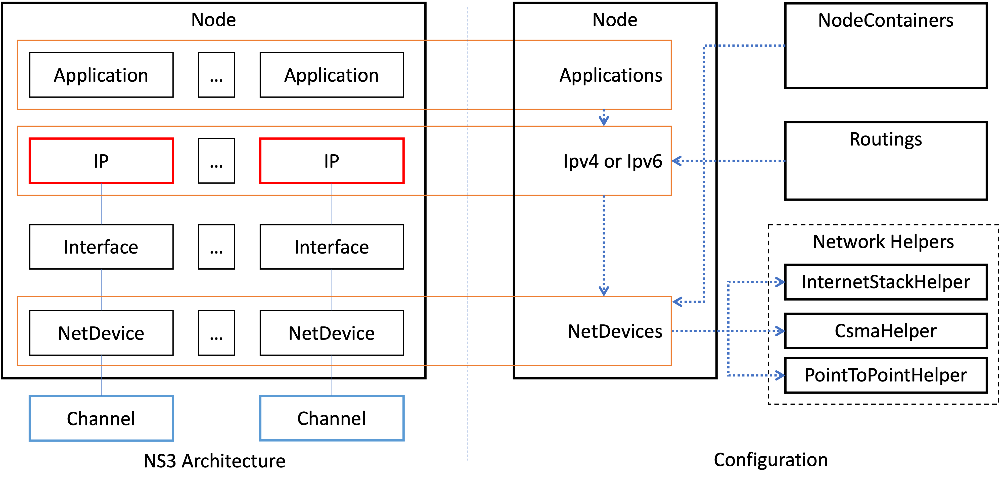

# Purpose

This is a simulation scenario template loading a topology configuration file to avoid hard coding. The location of the targeted code is `examples/routing/RADICS_MiM_DNP3.cc`.

# Topology configuration

The topology configuration captures key components of ns3. The following diagram depicts structure of the ns3 key components and how they are reflected to the configuration. 



The following four components is JSON node in the top level.
- Nodes: A list of `Node`. `Node` contains `Applications`, `NetDevices`, and `Ipv4`. 
- NodeContainers: A list of `NodeContainer`. `NodeContainer` has `Node`s and network helper information to install. 
- Network Helpers: `InternetStackHelper`, `CsmaHelper`, `PointToPointHelper`.
- Routings: `Routings` contains routing information.

The following shows the JSON key structure.
```json
{
    "Nodes":[{
            "id":"ControlCenter",
            "Applications":[...],
            "NetDevices":[... ],
            "Ipv4":[...]
        },
        ...
    ],
    "NodeContainers":[
        {
            "install":["p2p"],
            "Nodes":[...]
        },
        ...
    ],
    "CsmaHelper":
    {
        "id":"Csma",
        "DeviceAttributes":{... }
    },
    "InternetStackHelper":
    {
        "id":"InternetStack"
    },
    "PointToPointHelper":
    {
        "id":"p2p",
        "DeviceAttributes":{...},
        "ChannelAttributes":{...}
    },
    "Routings":[...]
}
```


## ID Reference

In order to refer instances of ns3 objects, `id` property is used. 
- `DNP3Application` requires `LocalAddress` and `RemoteAddress`. The address should be `id` of one of `Ipv4` elements.
- `Ipv4` binds `NetDevice`. Within the same `Node`, `NetDevice` of `Ipv4` should be `id` of one of `NetDevices` elements.
- Each of `Nodes` in `NodeContainers` points out `Node`. `id` of a element of `Nodes` in `NodeContainers` should be `id` of `Nodes` in the top level. 
- `NodeContainers` can be used to install network helpers. `install` contains helpers' `id`s.
- After installing helpers in `NodeContainers`, `NetDevice` should be specified so that `NetDevice` can be referred to. `NetDevice` of `Node` in `NodeContainers` should be `id` of one of `NetDevices` in `Node`.


## Simulation configuration

Ideally, any other configurations need to be stored in a different file for modularity. For convenience, a topology configuration file contains configurations that are not directly related to topology.
- `output_dir`: A path of simulation output files, such as pcap files.
- `pcap_prefix`: Prefix of pcap file.
- `Schedules`: A list of ns3 `Simulator::Schedule`s, which allow to invoke functions at a certain time such as `Dnp3Application::periodic_poll`.

